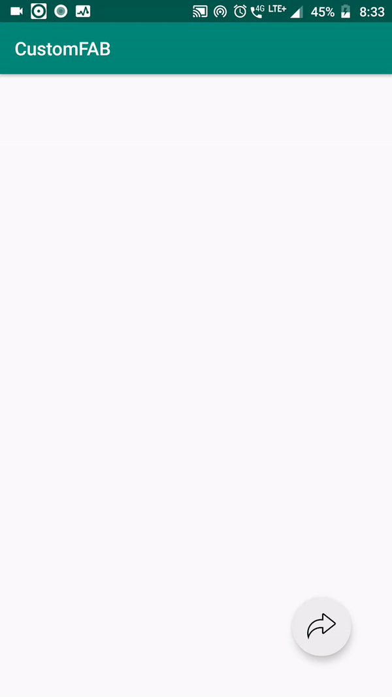

# CustomFloatingActionButton

CustomFloatingActionButton is a flexible library for drawing beautiful menu inflating widgets onto the screen, built as part of the Build-brake-code-1.0 organized by PCON, NIT Jamshedpur.


### API level
21+


### Demo


### Usage

- Add it in your root level `build.gradle` file, at the end of repositories:
    ```
   allprojects {
      repositories {
        maven { url 'https://jitpack.io' }
      }
   }
  ```
- Add this dependency in your app level `build.gradle` file:
  ```
  dependencies {
	    implementation 'com.github.hunsman98:CustomFloatingActionButton:1.0'
  }
	```

### XML

  ```
  <com.purusharth.customfloatingactionbutton.CustomFloatingActionButton
        android:layout_width="1dp"
        android:layout_height="1dp"
        app:dim="350dp"
        app:childCount="5"
        app:quadrant="2"
        app:parentDim="64dp"
        app:childDim="48dp"
        app:parentBackgroundTint="@color/colorPrimary"
        app:childBackgroundTint="@color/colorAccent"
        app:layout_marginRight="32dp"
        app:layout_marginBottom="32dp"
        app:layout_alignParentBottom="true"
        app:layout_alignParentRight="true"
        android:id="@+id/customFAB"/>
  ```
  
  ### Add onClickListener for a view
  ```
  mCustomFabView.addParentClickListener(onClickListener);
  mCustomFabView.addChildClickListener(onClickListener, child_index);
  ```
 
  ### Set ImageResource for a view
  ```
  mCustomFabView.setParentImageResource(R.drawable.img)
  mCustomFabView.setChildImageResource(R.drawable.img, child_index)
  ```
  
  ### Set ImageResource for a view
  ```
  mCustomFabView.setParentImageResource(R.drawable.img)
  mCustomFabView.setChildImageResource(R.drawable.img, child_index)  
  ```
  
  ### Set background color for a view
  ```
  mCustomFabView.setParentBackgroundTint(R.color.color)
  mCustomFabView.setChildBackgroundTint(R.color.color, child_index)  
  ```
  
  
